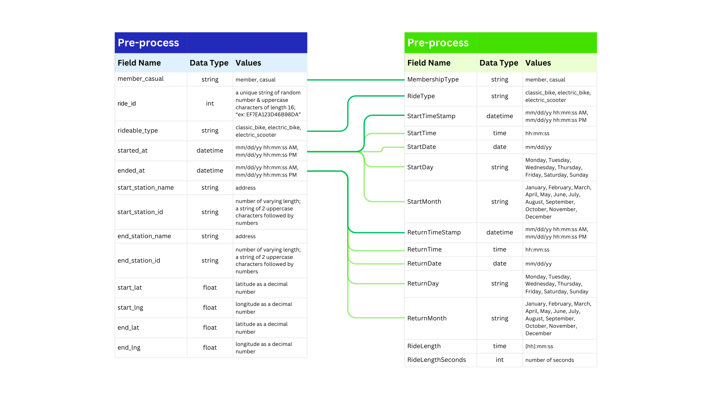

# Project Background
Cyclistic, launched in 2016, is a hypothetical bike-sharing company created for the purposes of this capstone project. While the company itself does not exist, the analysis is grounded in real-world data from the Divvy bike-share program in Chicago.

The project explores the behavioral differences between casual riders—those who purchase single or daily passes—and annual members, to uncover insights that can inform strategies to drive membership growth. Cyclistic’s finance analysts have identified that annual members generate greater long-term value compared to casual riders, positioning casual users as a strategic target for conversion, an area that will serve as the primary focus of this study.

This project intends to uncover key insights and trends that will assist the marketing team by identifying critical aspects to prioritize in potential marketing strategies.

Insights and recommendations are provided on the following key areas:
- **Customer Behavior Analysis:** Evaluation of consumer behavior trends throughout the year, focusing on ride volume, seasonal usage, and duration of trips of casual riders and members.
  
- **Product/Service Usage Analysis:** Analysis of ride patterns for casual riders versus members, emphasizing product preference.
  
- **Time-of-Day and Day-of-Week Patterns:** Assessment of datetime riding patterns, focusing on time-of-day and weekday vs. weekend usage.

dashboard [here.]()

statistics [here.]()

report summary graphics [here.]()

# Data Structure

The Cyclistic dataset structure, shown below, retains essential fields for analysis while excluding personally identifiable information (PII). Additional time-related fields were derived to enable more detailed exploration of usage patterns.

The City of Chicago, in partnership with Lyft Bikes and Scooters, LLC, provides publicly available data for this analysis. The dataset adheres to usage terms, is anonymized to protect individual privacy, and is used solely for non-commercial and ethical purposes, with the relevant license provided [here.]()

The processed dataset can be found [here.]()

# Executive Summary
### Overview of findings
This report analyzes Cyclistic’s 2024 bike usage trends, using data from January to December, with a focus on June through September—the months when casual riders accounted for nearly 50% of total rides, the highest balance observed throughout the year.

Key findings indicate that casual riders take longer trips on average, though with greater variation in ride duration, whereas Cyclistic members maintain more consistent trip lengths. Peak usage patterns also differ: casual ridership peaks at 5 PM, likely driven by leisure activities, while members show peak usage at both 8 AM and 5 PM, aligning with commuting trends. Additionally, ride durations increase on weekends, suggesting higher recreational use, and electric bikes are the preferred choice over classic bikes during these months.

### Customer Behavior Analysis: (target month graph)

### Product/Service Usage Analysis: (general table of preferred biketype by month)

### Time-of-Day and Day-of-Week Patterns: (graph/graphs) for time data

## Recommendations:

Based on the uncovered insights, the following recommendations have been provided:

- **Offer limited-time discounts or trial memberships** from **June to September**, when **casual ridership peaks at nearly 50%**, to drive conversions.

- **Highlight cost savings for frequent riders** and promote **commuter benefits (e.g., “Skip Traffic, Save Time”)** to attract potential members.

- **Use leisure-oriented messaging (e.g., “Ride More, Pay Less”)** to appeal to casual riders, who typically take longer trips in the **evenings and weekends**.

- **Offer perks like discounts on electric bikes, extended ride times, and weekend ride credits** to attract casual riders and help convert them into long-term members.

