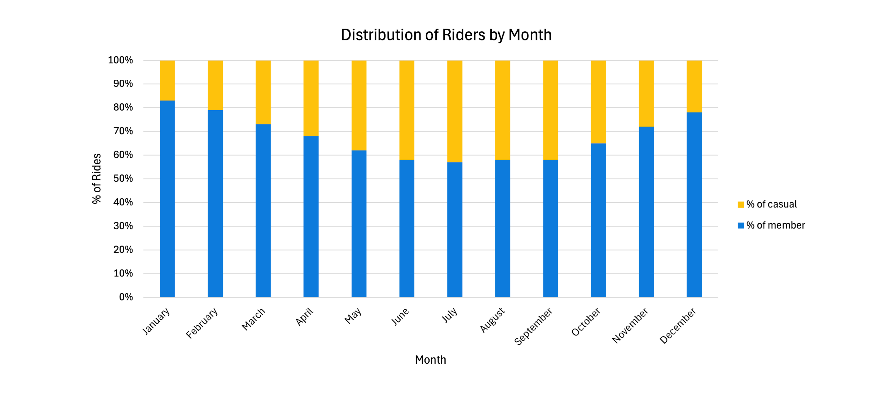
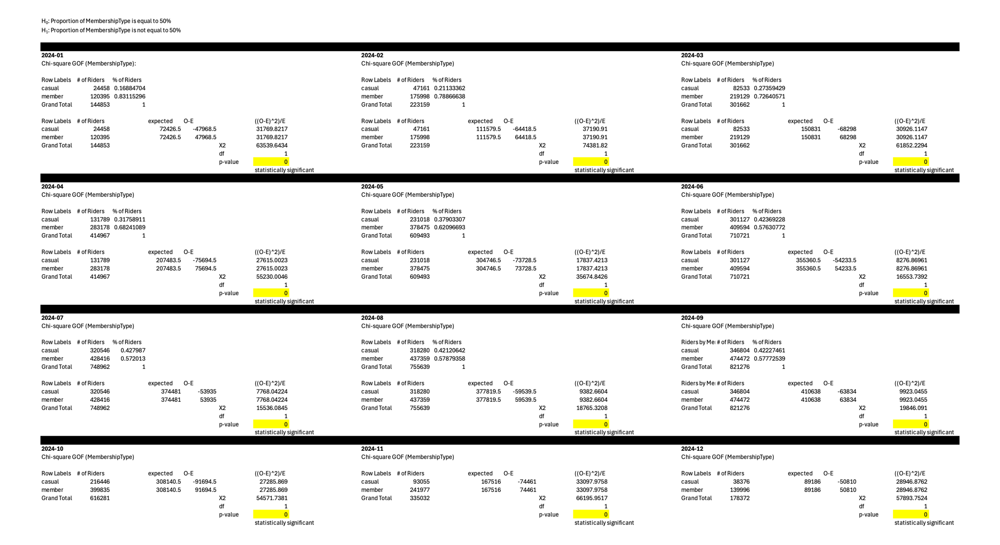
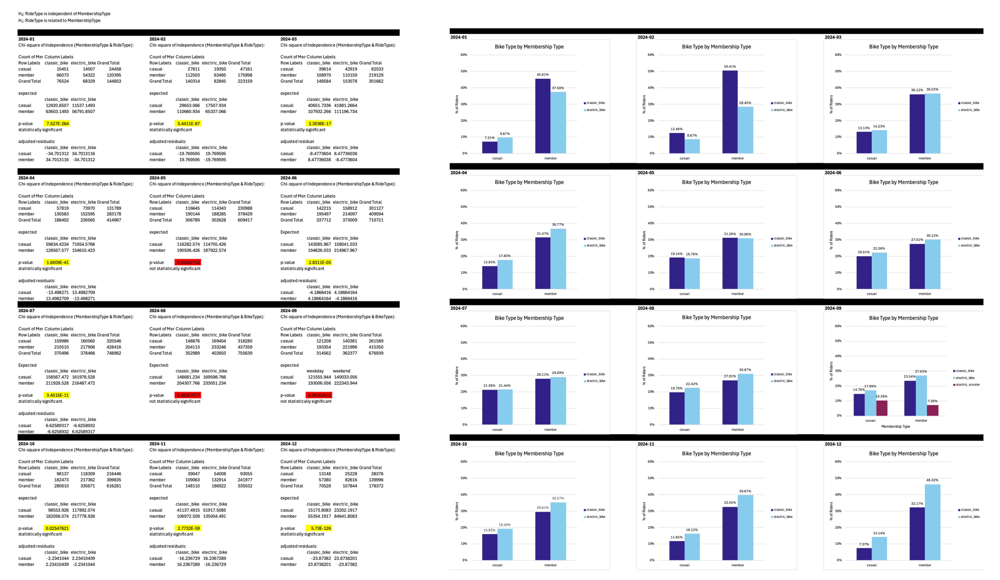
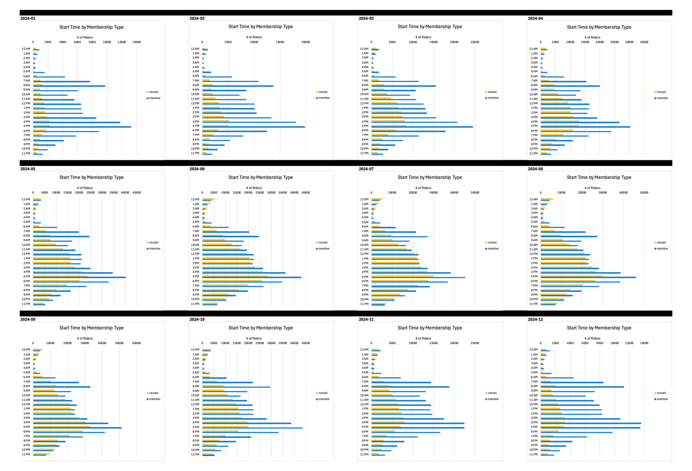
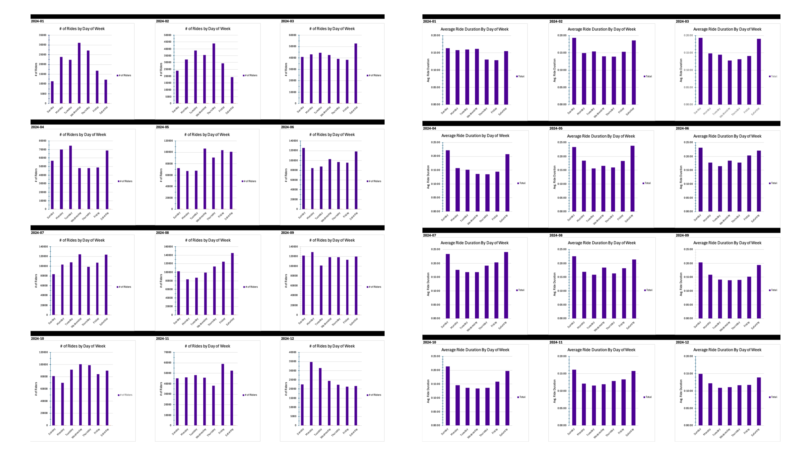

# Project Background
Cyclistic, launched in 2016, is a hypothetical bike-sharing company created for the purposes of this capstone project. While the company itself does not exist, the analysis is grounded in real-world data from the Divvy bike-share program in Chicago.

The project explores the behavioral differences between consumer groups, casual riders—those who purchase single or daily passes—and Cyclistic members- annual subscribers, to uncover insights that can inform strategies to drive membership growth. Cyclistic’s finance analysts have identified that annual members generate greater long-term value compared to casual riders, positioning casual users as a strategic target for conversion, an area that will serve as the primary focus of this data analysis study.

This project intends to uncover key insights and trends that will assist the marketing team by identifying critical aspects to prioritize in potential marketing strategies.

Insights and recommendations are provided on the following key areas:
- **Customer Behavior Analysis:** Evaluation of consumer behavior trends throughout the year, focusing on ride volume, and seasonal usage.
  
- **Product/Service Usage Analysis:** Analysis of ride patterns for casual riders versus members, emphasizing product preference.
  
- **Time-of-Day and Day-of-Week Patterns:** Assessment of datetime riding patterns, focusing on time-of-day and weekday vs. weekend usage.

The dataset of interest can be found [here.](2024_Cyclisticdata)

The final report can be found [here.](Cyclistic_Documents/2024Cyclistic_report.pdf)

The activity log can be found [here.](Cyclistic_Documents/Cyclistic_Capstone_ProjectLog.pdf)

# Data Structure

The Cyclistic dataset structure, shown below, retains essential fields for analysis while excluding personally identifiable information (PII). Additional time-related fields were derived to enable more detailed exploration of usage patterns.

The City of Chicago, in partnership with Lyft Bikes and Scooters, LLC, provides publicly available data for this analysis. The dataset adheres to usage terms to anonymize and protect individual privacy, and is used solely for non-commercial and ethical purposes, with the relevant license provided [here.](Cyclistic_Documents/Data_License_Agreement_Divvy_Bikes.png)

# Executive Summary

### Overview of findings
This report analyzes Cyclistic’s 2024 bike usage trends, using data from January to December, focusing on June through September—the months when casual riders accounted for nearly 50% of total rides, the highest balance observed throughout the year.

Key findings indicate that casual riders take longer trips on average, though with greater variation in ride duration, whereas Cyclistic members maintain more consistent trip lengths. Peak usage patterns also differ: casual ridership peaks at 5 PM, likely driven by leisure activities, while members show peak usage at both 8 AM and 5 PM, aligning with commuting trends. Additionally, ride durations increase on weekends, suggesting higher recreational use, and electric bikes are the preferred choice over classic bikes during these months.

### Customer Behavior Analysis:

- Analysis showed that **casual riders represented a higher share of total rides between June and September** than in other months, reflecting a clear seasonal trend.

- Rider activity throughout 2024 exhibited **statistically significant monthly differences between casual and member users**, as confirmed by **Chi-Square Goodness-of-Fit tests**. In every month, ride distribution deviated significantly from an even 50/50 split (p < 0.05), indicating **distinct usage patterns between the two groups.**
  

### Product/Service Usage Analysis:

- **Electric bikes saw increased usage** among both casual riders and Cyclistic members during the summer months, indicating a seasonal preference.
  
- However, **statistical analysis** reveals a notable distinction in overall bike type preference: **casual riders show a stronger inclination toward electric bikes**, whereas **Cyclistic members more frequently choose classic bikes.**
  

### Time-of-Day and Day-of-Week Patterns:

- **Casual riders exhibit a distinct peak in activity around 5 PM**, suggesting a preference for evening or leisure-based trips. In contrast, **Cyclistic members show two prominent usage peaks—at 8 AM and 5 PM**—reflecting typical commuting patterns aligned with standard work hours.
  
- While **total ride volume does not display a clear pattern across the days of the week**, the data reveals a noticeable **increase in average ride duration on weekends**.

## Recommendations:

Based on the uncovered insights, the following recommendations have been provided:

- **Offer limited-time discounts or trial memberships** from **June to September**, when **casual ridership peaks at nearly 50%**, to drive conversions.

- To attract potential members, **Highlight cost savings for frequent riders** and promote **commuter benefits (e.g., “Skip Traffic, Save Time”)**.

- **Use leisure-oriented messaging (e.g., “Ride More, Pay Less”)** to appeal to casual riders, who typically take longer trips in the **evenings and weekends**.

- **Offer perks like discounts on electric bikes, extended ride times, and weekend ride credits** to attract casual riders and help convert them into long-term members.
